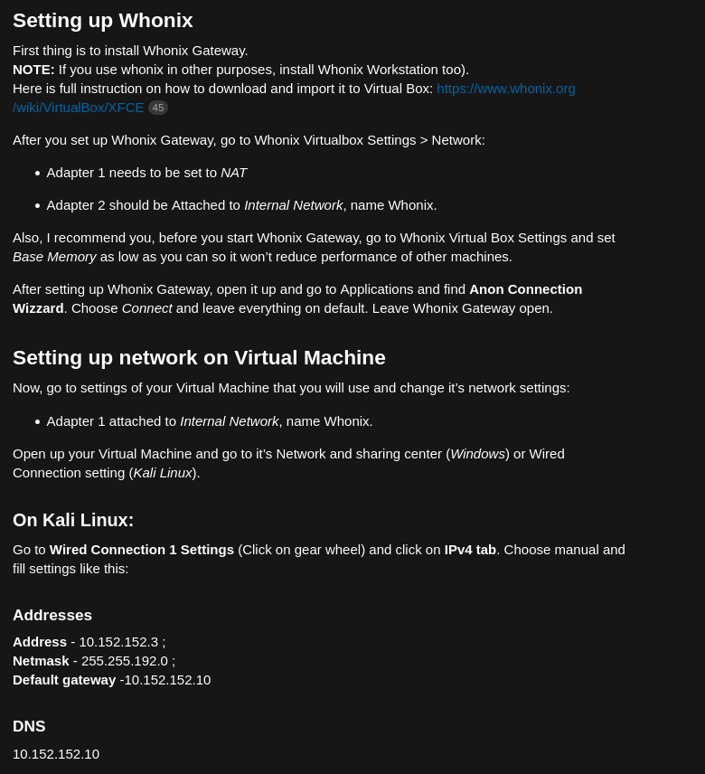

# Debian_OSINT_VM
<div align="center">
  
 <br><br>
 <p><i>"the best sword remains in its sheath"</i></p>
</div>
<br><br>
<h2>OSINT tools for researching. OSINT virtual machine.</h2>

<div align="center">
  
</div>
<br><br>

**Install:**

Install <a href="https://www.debian.org/download">Debian 12</a>

update and upgrade

```console
git clone https://github.com/midnit3Z0mbi3/Debian_OSINT_VM.git

chmod +x *.sh

sudo bash debian_packages_osint.sh

bash debian_pipx_git_osint_tools.sh

sudo bash snoint.sh

```

**Change DNS:**

sudo bash change_dns.sh

reboot

**How to install latest version of Go:**

Download the latest version of <a href="https://go.dev/dl/">Go</a>

Extract the archive file

sudo tar -C /usr/local -xzf /home/$USER/Downloads/go{version of GO}linux-amd64.tar.gz

Make sure your PATH contains /usr/local/go/bin

echo $PATH | grep "/usr/local/go/bin"

nano .bashrc

**Install go packages:**

bash go.sh


**Downloads:**


<a href="https://go.dev/dl/">Go</a>, <a href="https://www.maltego.com/downloads/">Maltego</a>, 
<a href="https://portswigger.net/burp/communitydownload">Burp Suite</a>, 
<a href="https://apt.metasploit.com/">Metasploit</a>, 
<a href="https://protonvpn.com/">Protonvpn</a>, 
<a href="https://www.torproject.org/download/">Tor Browser</a>, 
<a href="https://www.google.com/earth/about/versions/">Google Earth Pro</a>, 
<a href="https://support.google.com/chrome/a/answer/9025903?hl=en">Google Chrome</a>


**firefox extensions:**

firefox containers, ublock origin, downthemall, bulk media downloader, fireshot, nimbus, singleFile, exifviewer, user agent switcher, image search options, reveye reverse search,

search by image, ressurrect pages, web archives, copy selected links, onetab, stream detector, joplin webclipper, foxyproxy, adguard, javascript toggle on and off, ghunt companion, download all images, keepassxc

the firefox extension store, firefox ADD-Ons, has a lot of useful AI web extensions, and other extensions that can aid in your research. 

**chrome web store extensions:**

InVID WeVerify, ublock origin, adguard, downthemall, fireshot, singleFile, onetab, reveye reverse search, web archives

the chrome web store has a lot of useful AI web extensions, and other extensions that can aid in your research.

**OSINT Techniques:**

If you have read <a href="https://www.osinttechniques.com/">OSINT Techniques</a> by Michael Bazzell

I would recommend using the search tools he provides. As well as the flow charts and templates.
<br><br>
<h2>
 
 **Anonymize virtual machines with <a href="https://www.whonix.org/wiki/Download">Whonix</a> for an extra layer of security:**
 
</h2>


<br>
<div align="center">

  
  
</div>
<br><br><br>

